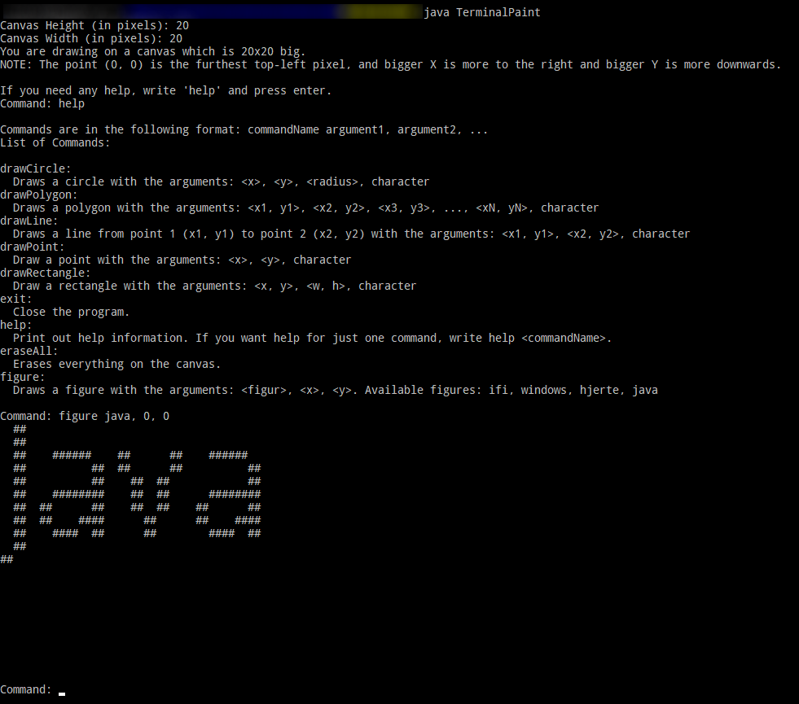

# About
Terminal paint is a simple command-styled terminal-based paint program that uses characters for the "colors". The code and its comments is in norwegian, but I've translated the program output to english.

# How to use
When you first start the program, it asks you for the dimensions of the canvas in pixels, just follow the prompts. To start drawing, you will have to type in commands in the format `cmd <arg1> <arg2>...<argN>`. The canvas will update and drawn on the screen after each command.

# Screenshots

